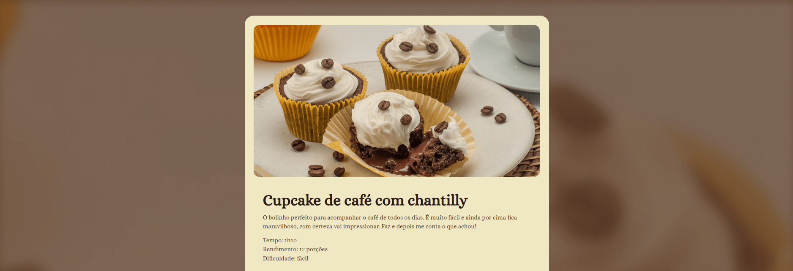

# Página de Receita 🍰


*Preview do projeto — página de receita.*

Projeto desenvolvido como parte do curso Full-Stack da Rocketseat, utilizando HTML e CSS.

## Tecnologias
- HTML5
- CSS3

## Objetivo
Treinar a estruturação de páginas com HTML e a estilização com CSS, simulando a criação de uma página de receita.

## Como visualizar
1. Clone o repositório:
   ```bash
   git clone https://github.com/muddyorc/pagina_receita.git
